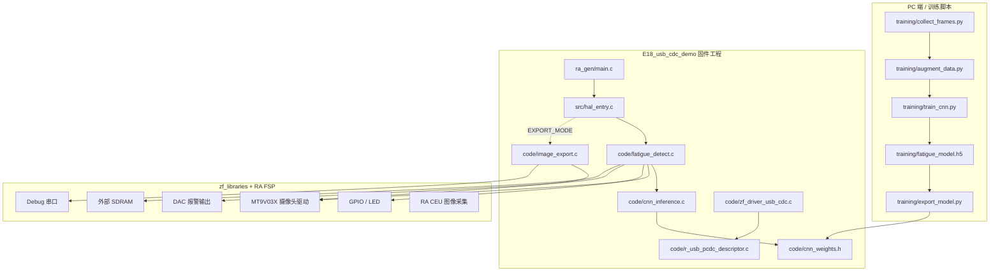
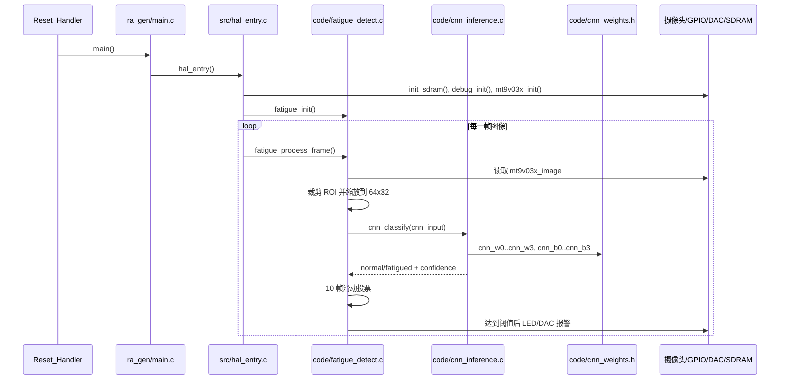
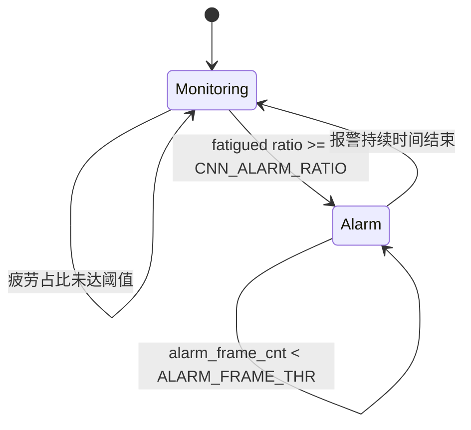
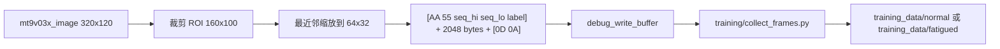
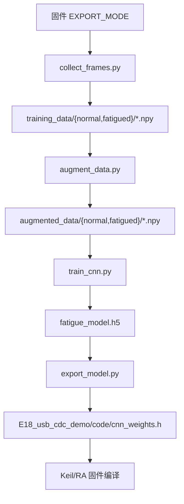

# QianSai 代码图谱

这份文档用于快速理解项目的主代码路径：RA8D1 固件、疲劳检测 CNN、图像导出模式，以及 Python 训练/导出流水线。

## 项目分层



## 运行模式

默认固件模式是 AI 疲劳检测。`main()` 进入 `hal_entry()` 后，会初始化 SDRAM、Debug 串口和 MT9V03X 摄像头，然后在主循环中持续处理摄像头帧。



## AI 推理路径

部署到 MCU 上的是一个自定义的小型 Keras CNN，训练完成后被导出为 C 语言 `float` 权重数组。单片机侧没有使用通用推理框架，而是在 `cnn_inference.c` 中手写前向推理。

```mermaid
flowchart LR
    A["64x32 uint8 灰度 ROI"] --> B["normalize_input: /255.0"]
    B --> C["Conv1: 5x5, 8 filters, stride 2, ReLU"]
    C --> D["Pool1: 2x2"]
    D --> E["Conv2: 3x3, 16 filters, ReLU"]
    E --> F["Pool2: 2x2"]
    F --> G["Flatten: 192"]
    G --> H["Dense: 192 -> 32, ReLU"]
    H --> I["Dense: 32 -> 2"]
    I --> J["Softmax"]
    J --> K["0 = normal, 1 = fatigued"]
```



关键实现点：

- `code/cnn_inference.h` 定义 CNN 输入尺寸和输出标签：`CNN_INPUT_W=64`、`CNN_INPUT_H=32`、`CNN_NORMAL=0`、`CNN_FATIGUED=1`。
- `code/cnn_inference.c` 实现推理算子：`normalize_input`、`conv2d_stride`、`conv2d`、`maxpool2x2`、`dense`、`softmax`。
- `code/cnn_weights.h` 保存由 `training/export_model.py` 生成的浮点权重和模型层尺寸宏。
- 中间特征图放在 `.bss.sdram`，因此当前固件假设板子具备外部 SDRAM。

## 疲劳检测状态机



关键阈值定义在 `code/fatigue_detect.h`：

- ROI：从 320x120 摄像头图像中裁剪 `(80,10)` 到 `(240,110)` 区域。
- 投票窗口：`CNN_SMOOTH_N = 10` 帧。
- 报警阈值：`CNN_ALARM_RATIO = 60`。
- 报警时长：`FATIGUE_ALARM_MS = 5000`，帧率按 `FATIGUE_FPS = 80` 计算。

## 图像导出模式

当 `src/hal_entry.c` 中启用 `EXPORT_MODE` 时，固件会从推理模式切换到数据导出模式。该模式裁剪同一块摄像头 ROI，缩放为 `64x32`，封装成串口帧后发送到 PC，用于采集训练数据。



## 训练与部署流水线



常用命令：

```powershell
python training/collect_frames.py --port COM3 --label normal
python training/collect_frames.py --port COM3 --label fatigued
python training/augment_data.py --input training_data --output augmented_data --multiply 5
python training/train_cnn.py --data augmented_data --epochs 30 --output fatigue_model.h5
python training/export_model.py --model fatigue_model.h5 --output ../E18_usb_cdc_demo/code/cnn_weights.h
```

## 关键文件

| 文件 | 作用 |
| --- | --- |
| `E18_usb_cdc_demo/ra_gen/main.c` | 自动生成的入口文件，调用 `hal_entry()`。 |
| `E18_usb_cdc_demo/src/hal_entry.c` | 固件顶层初始化和主循环，负责选择疲劳检测模式或图像导出模式。 |
| `E18_usb_cdc_demo/code/fatigue_detect.c` | 运行时疲劳检测流水线：帧同步、ROI 缩放、CNN 调用、投票、报警输出。 |
| `E18_usb_cdc_demo/code/fatigue_detect.h` | 疲劳检测 ROI、投票/报警参数、状态枚举和诊断结构体。 |
| `E18_usb_cdc_demo/code/cnn_inference.c` | RA8D1 侧手写 `float` CNN 前向推理实现。 |
| `E18_usb_cdc_demo/code/cnn_inference.h` | CNN 输入/输出和推理接口声明。 |
| `E18_usb_cdc_demo/code/cnn_weights.h` | 生成的模型权重和层尺寸定义。 |
| `E18_usb_cdc_demo/code/image_export.c` | 用于 PC 端采集样本的数据导出路径。 |
| `E18_usb_cdc_demo/code/image_export.h` | 导出 ROI、输出尺寸、标签和跳帧设置。 |
| `E18_usb_cdc_demo/code/zf_driver_usb_cdc.c` | USB CDC 辅助实现。 |
| `E18_usb_cdc_demo/code/r_usb_pcdc_descriptor.c` | USB CDC 描述符。 |
| `training/collect_frames.py` | 读取固件导出的串口帧，并保存 `.npy` 样本。 |
| `training/augment_data.py` | 对采集样本做亮度、翻转、噪声和平移增强。 |
| `training/train_cnn.py` | 构建并训练 Keras CNN 模型。 |
| `training/export_model.py` | 将 Keras `.h5` 权重转换为 `cnn_weights.h`。 |

## 外部依赖

固件还依赖 `E18_usb_cdc_demo/code` 之外的板级库和生成代码：

- `zf_libraries`：通用类型、Debug 串口、延时、GPIO、DAC、摄像头辅助 API 和设备头文件。
- RA FSP 生成代码：`hal_data`、CEU 摄像头采集实例、BSP 启动代码和 USB 协议栈组件。
- MT9V03X 摄像头全局对象：`mt9v03x_image`、`mt9v03x_finish_flag`、`MT9V03X_W`。
- 外部 SDRAM：CNN 中间特征图和图像缓冲通过 `.bss.sdram` 使用。

## 高价值扩展点

- 修改 `training/train_cnn.py` 中的 CNN 结构，重新训练后再生成 `code/cnn_weights.h`；同时要保证 `code/cnn_inference.c` 支持新的层尺寸。
- 在 `code/fatigue_detect.h` 中调整 ROI、投票窗口和报警比例，用于改变检测灵敏度。
- 使用 `src/hal_entry.c` / `code/image_export.h` 中的 `EXPORT_MODE` 与 `EXPORT_LABEL` 采集新的训练样本。
- 将 `code/cnn_inference.c` 中的浮点推理替换为量化或 CMSIS-NN 风格算子，以提升 MCU 推理性能。
